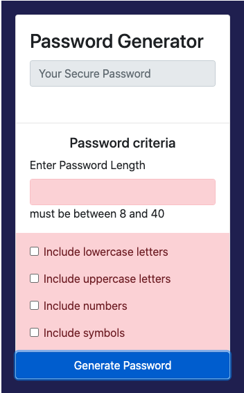

# 03 JavaScript: Password Generator

This is a random password generator app. It fulfils the requirements outlined in the user story namely

provides an employee with access to sensitive data
* a randomised password with combination of lower, upper, numeric and special characters depending on the users input
* the app ensures that the password generator will be unique and therfore provide greater security.

## Acceptance Criteria
I changed some of the acceptance criteria with suitable alternatives. I have marked them below.

```
GIVEN I need a new, secure password
WHEN I click the button to generate a password
THEN I am presented with a series of prompts for password criteria
WHEN prompted for password criteria 
        --- instead of a prompt to gather input I chose to use check boxes and a number field. This was done in consultation            with the instructors and their permission.
THEN I select which criteria to include in the password
WHEN prompted for the length of the password
THEN I choose a length of at least 8 characters and no more than 128 characters
WHEN prompted for character types to include in the password
THEN I choose lowercase, uppercase, numeric, and special characters
WHEN I answer each prompt
THEN my input should be validated and at least one character type should be selected
        --- if the user does not select the required input an alert box, red highlight and inner HTML are shown to direct user          to enter correct input
WHEN all prompts are answered
THEN a password is generated that matches the selected criteria
WHEN the password is generated
THEN the password is either displayed in an alert or written to the page
```

The following image demonstrates the application functionality:


If the user does meet the criteria the app alerts the user with an alert box and red highlight pointing out the fields that require input as shown below.



## Review

I have submitted the following 

- The URL of the deployed application.

- The URL of the GitHub repository. Give the repository a unique name and include a README describing the project.
